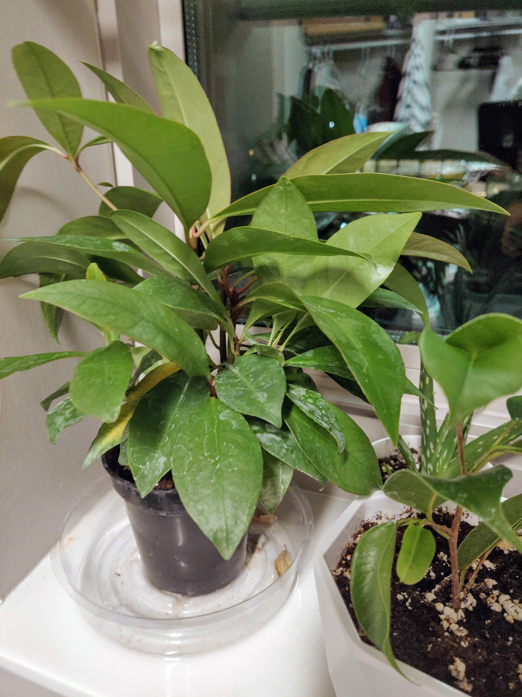
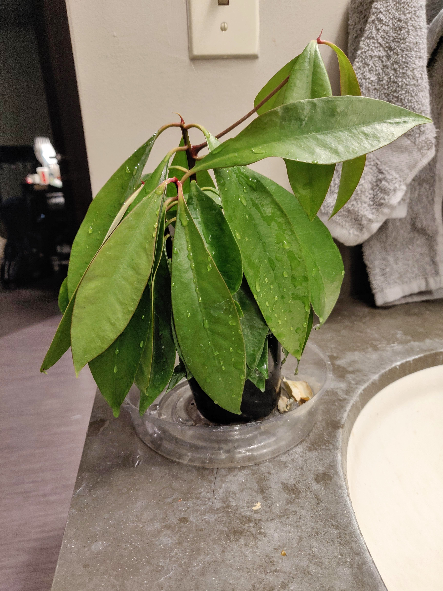
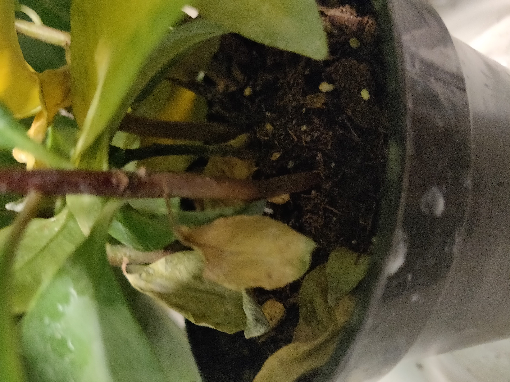
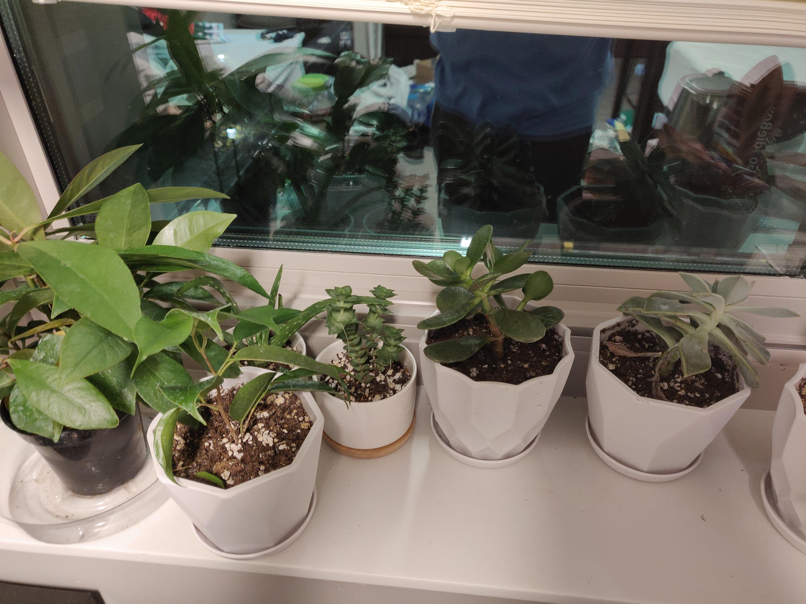

Kyle Zheng

**NAME**: Coralberry, aka *Symphoricarpos orbiculatus*

**INITIAL CONDITION:**

The plant was healthy when I received it but still very young. I put it on my dorm windowsill, because that location received the most sunlight throughout the day and it was somewhere I could see it all the time.

**RECOMMENDED CARE**

According to the [Morton Arboretum](https://www.mortonarb.org/trees-plants/tree-plant-descriptions/coralberry), the Coralberry thrives under full sun or partial sun/shade for around 6 hours daily. It grows best in well drained soil but is not picky. Some potential problems are *mildew*, *anthracnose*, *aphids* and *scale*. Since this would be grown inside, I was not particulary wary of insect problems, but proper water and drainage was a must. I already put it in the best location for sunlight.

**ACTUAL CARE**

Following the guidance given, I left it on the windowsill and watered it when I remembered. The container drained well so the soil never stayed too wet. It turned out to be pretty easy to take care of.

**PROBLEMS I FACED**

I did not face any problems with disease or insects. Due to how well the plant thrived even under neglect sometimes I forgot to water it without noticing and the leaves became very droopy. My forgetfulness turned out to be the main problem I faced.

However, the plant recovered very quickly after some emergency watering. 

Another problem was that many of the interior leaves could not get any sunlight and slowly shriveled away. Due to their position, these were also different to reach for removal. This was somewhat annoying but overall the plant was not in any danger.

 Thankfully none of these issues were life threatening to the plant!

**RESULTS**

 The coralberry survived and thrived and was joined by many other plants on the windowsill. It grew many more leaves and become slightly larger than when I got it. It also has some new tall growth which is pretty exciting! 

**CONCLUSIONS**

My plant lived because I did not completely forget about it and it is naturally very hardy and resilient. It dealt with my neglect and happily revived itself after watering. I am happy I chose such a nice plant.

